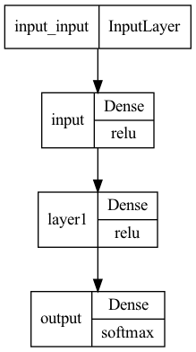

# AI-Powered PUBG Winner Prediction 

This project aims to predict the final top 4 teams of [PUBG](https://www.pubgesports.com/) e-sports game using the Machine learning technology.  
It was created based on [Super Rule](Introduction/super_v3_0_0.pdf).  
('WWCD Format' Games are also possible)  
You can use this Machine learning Model to compare the overall power of participating teams.  
This project can be used for Pick'em Challange's Top 4 Prediction event.  
  
이 프로젝트는 머신러닝 기술을 사용하여 PUBG 이스포츠의 최종 상위 4팀을 예측합니다.  
[Super Rule](Introduction/super_v3_0_0.pdf)을 기반으로 제작되었습니다.  
('WWCD 포맷' 경기에도 사용 가능합니다)  
본 머신러닝 모델로 참가 팀의 전반적인 전력을 비교할 수 있습니다.  
이 프로젝트는 Pick'em Challange의 Top 4 예측 이벤트에 사용될 수 있습니다.  
  
# Required Environment  
- Python 3.8.13
- Tensorflow 2.0.0
- Keras 2.3.1
  
# Data  
'Mean value of Place Points', 'Mean value of Kill Points' and 'Rank' were used as training data. 
  
팀별 'Place Point 평균', 'Kill Point 평균' 그리고 '순위'를 훈련 데이터로 사용했습니다.  
  
Type (형태)   
||X1|X2|Y|
|---|---|---|---|
|TEAM|MEAN VALUE OF PLACE POINTS|MEAN VALUE OF KILL POINTS|RANK|
|팀명|PLACE POINT 평균 & 표준화|KILL POINT 평균 & 표준화|순위|

  
Example (예시)    
|TEAM|MEAN VALUE OF PLACE POINTS & STANDARDIZATION|MEAN VALUE OF KILL POINTS & STANDARDIZATION|RANK|
|---|---|---|---|
|NH|2.06|1.97|1|
|HERO|2.25|1.54|2|
|VP|0.32|1.33|3|
|TSM|0.13|0.79|4|
  
For more information about data, refer to 'data' folders.  
  
데이터에 대한 자세한 내용은 'Sheet' 및 'Train_Data' 폴더를 참조하십시오.  
  
# Model Design    
  
  
### Model 1. PGIS_W5_Prediction_Model.h5
This model aimed to predict the winner of the PGI.S 2021 Weekly Final Week6.  
It was created based on the results until PGI.S Week5('Super Rule' games Only).  
1040 data used.  
500 epochs completed.  
  
이 모델은 PGI.S 2021 Weekly Final 6주 차의 상위 4팀 예측을 목표로 합니다.  
PGI.S 5주 차까지의 경기 데이터를 기반으로 제작되었습니다(Super Rule 게임만).  
1040개의 데이터가 사용되었습니다.  
30,000번 학습되었습니다.  
  
  
  
  
# Results(TBD)  
  
### PGI.S 2021 Weekly 5 Final   
|RANK|PREDICTION|RESULT|
|---|---|---|
|1|***META***|***GEN***|
|2|VP|***META***|
|3|***GEN***|IFTY|
|4|SQ|DA|
  
Model : PGIS_W4_Prediction_Model.h5 
  
### PGI.S 2021 Week 6 Final    
|RANK|PREDICTION|RESULT|
|---|---|---|
|1|STK|***SQ***|
|2|***SQ***|ZEN|
|3|FAZE|MCG|
|4|IFTY|4AM|
  
Model : PGIS_W5_Prediction_Model.h5  
  
### PGC 2021 Week 1 Final    
|RANK|PREDICTION|RESULT|
|---|---|---|
|1|ENCE|KPI|
|2|GEN|GBL|
|3|***TL***|***OATH***|
|4|***OATH***|***TL***|
  
Model : PGIS_ESL_Prediction_Model.h5  
  
### PGC 2021 Week 2 Final  
|RANK|PREDICTION|RESULT|
|---|---|---|
|1|NH|***TL***|
|2|ENCE|GNL|
|3|***TL***|***VP***|
|4|***VP***|GEX|
  
Model : PGIS_ESL_Prediction_Model.h5    
  
### PGC 2021 Week 3 Final  
|RANK|PREDICTION|RESULT|
|---|---|---|
|1|***NH***|GEN|
|2|OATH|NAVI|
|3|TL|***NH***|
|4|GBL|GEX|
  
Model : PGIS_ESL_Prediction_Model.h5      

### PGC 2021 Grand Final 
|RANK|PREDICTION|RESULT|
|---|---|---|
|1|***NH***|***NH***|
|2|ENCE|HERO|
|3|TL|VP|
|4|GEN|TSM|
  
Model : PGIS_ESL_Prediction_Model.h5     
  
# Demo (Google Colab) 
  
You can predict the results using the Web App environment.  
  
웹 환경에서 직접 예측하실 수 있습니다.  
  
Google Colab Link : [PUBG Super Rule Winner Prediction](https://colab.research.google.com/drive/17Y2pWz-iTXwxVTYHqD-5v8V3-reOOaIh?usp=sharing)  
Prediction Format Sheet : [Prediction Format Sheet](https://docs.google.com/spreadsheets/d/1BS1k9RSjcRc8ogW5Yf6vVraSqg4jPZPPmJN266yQXI8/edit?usp=sharing)  
  
# Future Plan  
  
Creating Prediction Models by Maps (Miramar & Erangel)  
   
맵별 예측 모델 생성 (미라마 & 에란겔)  
